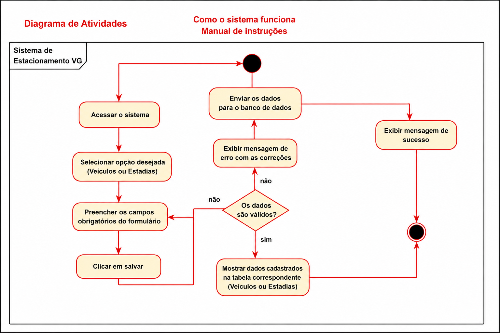
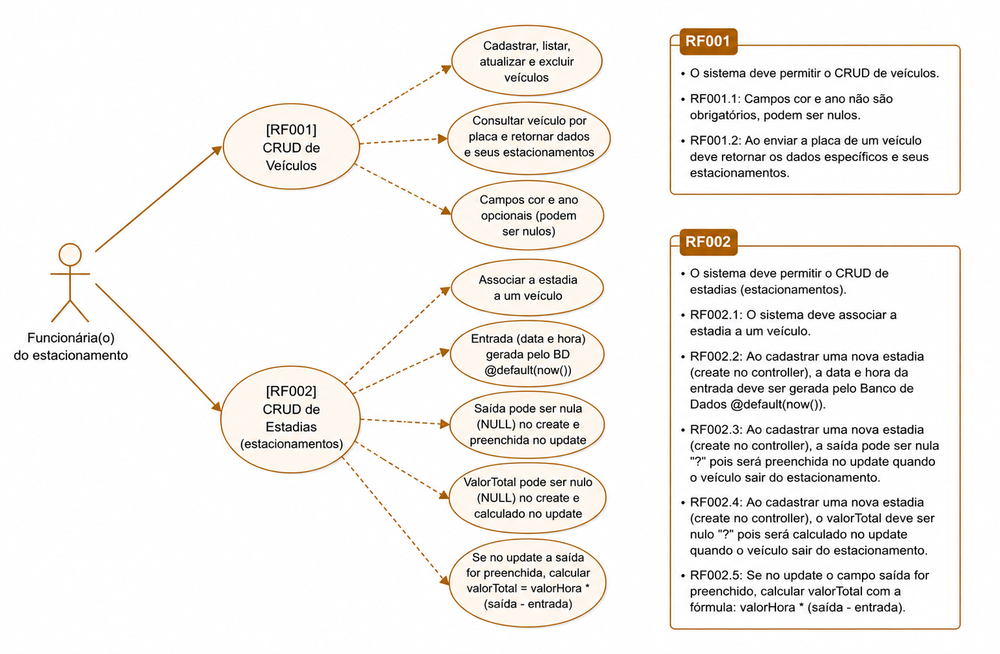

# 🚗 Sistema de Estacionamento VG

Sistema desenvolvido para gerenciamento de veículos e estadias em um estacionamento.

---

# 📌 Diagrama de Atividades

<p align="center">
  
</p>

---

# 📌 DER do Sistema

<p align="center">
  
</p>

---

# 📌 Funcionalidades

- Cadastro de veículos
- Registro de entrada e saída
- Controle de estadias
- Cálculo de valor por hora
- Exclusão de veículos e estadias

---

# 📌 Tecnologias Utilizadas

- Node.js
- Express
- Prisma ORM
- MySQL
- JavaScript

---

# 📌 Como executar o projeto

```bash
npm install